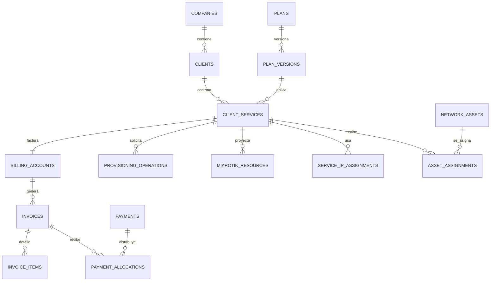

# Modelo relacional de CuzoNet

## Propósito

Este es el modelo lógico normalizado para el ERP WISP. Define fuentes de verdad, relaciones, restricciones e índices antes de escribir migraciones. Las migraciones físicas se derivarán de este documento y deberán conservar compatibilidad entre SQLite y PostgreSQL.

## Convenciones transversales

- Toda tabla de negocio tiene `id` UUIDv7 generado por Application y `company_id` cuando pertenece a una empresa.
- Timestamps: `created_at`, `updated_at` y, cuando aplica, `archived_at`, siempre en UTC.
- Dinero: enteros `*_cents`; nunca `float`.
- Velocidades: enteros `*_kbps`; direcciones IPv4/IPv6 se almacenan en formato canónico.
- Estados: códigos restringidos por catálogo o `CHECK`; no texto libre.
- Eliminación: clientes, servicios, planes y documentos financieros se archivan o cancelan; no se eliminan físicamente si tienen referencias históricas.
- Configuración dinámica y atributos poco frecuentes pueden usar JSON validado, pero las relaciones, importes, estados y campos consultables permanecen normalizados.

## Vista de relaciones principales

## Organización, usuarios y seguridad

| Tabla | Campos clave | Relaciones y finalidad |
|---|---|---|
| `companies` | `id`, `legal_name`, `display_name`, `timezone`, `currency_code`, `status` | Empresa lógica. Se crea una sola inicialmente, pero permite multiempresa posterior. |
| `users` | `id`, `company_id`, `email`, `password_hash`, `display_name`, `status`, `last_login_at` | Operadores humanos. `email` único global o por compañía según la política de acceso. |
| `roles` | `id`, `company_id`, `code`, `name`, `is_system` | Roles por empresa. |
| `permissions` | `id`, `code`, `description` | Permisos globales estables, por ejemplo `clients.write`. |
| `user_roles` | `user_id`, `role_id` | Relación N:M con clave única compuesta. |
| `role_permissions` | `role_id`, `permission_id` | Relación N:M con clave única compuesta. |
| `api_clients` | `id`, `company_id`, `name`, `kind`, `status` | Identidad de n8n, IA u otra integración. |
| `api_keys` | `id`, `api_client_id`, `key_prefix`, `secret_hash`, `scopes`, `expires_at`, `revoked_at` | Claves rotables; solo se conserva el hash. |

## Clientes y catálogo comercial

| Tabla | Campos clave | Relaciones y finalidad |
|---|---|---|
| `clients` | `id`, `company_id`, `client_type`, `document_type`, `document_number`, `legal_name`, `status`, `archived_at` | Persona o empresa. No mezcla teléfonos ni direcciones. |
| `client_contacts` | `id`, `client_id`, `contact_type`, `value_normalized`, `value_display`, `is_primary`, `verified_at` | Teléfonos, correo y otros contactos. El teléfono se normaliza a E.164. |
| `client_addresses` | `id`, `client_id`, `label`, `address_line`, `latitude`, `longitude`, `is_service_address` | Direcciones y georreferencia; una puede ser la principal de servicio. |
| `client_notes` | `id`, `client_id`, `author_user_id`, `body`, `visibility`, `created_at` | Observaciones de historial; se agregan, no se sobrescriben. |
| `plans` | `id`, `company_id`, `code`, `name`, `service_type`, `is_active` | Identidad comercial estable del plan. |
| `plan_versions` | `id`, `plan_id`, `version`, `price_cents`, `download_kbps`, `upload_kbps`, `effective_from`, `effective_to` | Versiona precio y capacidad sin alterar contratos anteriores. |

Restricciones: `clients` tiene unicidad por `(company_id, document_type, document_number)` para registros no archivados; `plans` por `(company_id, code)`; `plan_versions` por `(plan_id, version)`; un cliente no puede tener dos contactos primarios del mismo tipo.

## Servicios y Provisioning

| Tabla | Campos clave | Relaciones y finalidad |
|---|---|---|
| `client_services` | `id`, `company_id`, `client_id`, `plan_version_id`, `service_type`, `lifecycle_status`, `billing_day`, `started_on`, `ended_on` | Servicio contratado. Su estado lógico es la autoridad; no depende de la respuesta del router. |
| `service_plan_history` | `id`, `service_id`, `from_plan_version_id`, `to_plan_version_id`, `reason`, `changed_by`, `changed_at` | Historial de cambio de plan y velocidad. |
| `service_status_history` | `id`, `service_id`, `from_status`, `to_status`, `reason_code`, `reason_detail`, `actor_type`, `actor_id`, `changed_at` | Auditoría específica de estados. |
| `provisioning_operations` | `id`, `company_id`, `service_id`, `operation_type`, `requested_state`, `status`, `attempt_count`, `requested_by`, `correlation_id`, `idempotency_key`, `payload`, `last_error` | Unidad persistente de alta, suspensión, reactivación, cambio de plan/IP/router o baja. |

`lifecycle_status` admite como mínimo `pending`, `active`, `suspended`, `cancelled` y `failed`. `provisioning_operations` admite `queued`, `running`, `succeeded`, `failed`, `cancelled` y `manual_review`.

La unicidad de `idempotency_key` se aplica por cliente de integración, ruta y solicitud. Una operación exitosa no se repite; una fallida conserva el error y los intentos.

## Inventario y topología WISP

| Tabla | Campos clave | Relaciones y finalidad |
|---|---|---|
| `asset_models` | `id`, `manufacturer`, `model`, `asset_type`, `specifications` | Catálogo de modelos: router, AP, switch, CPE, radio PTP, antena u otro. |
| `network_assets` | `id`, `company_id`, `asset_model_id`, `serial_number`, `mac_address`, `asset_type`, `status`, `acquired_on` | Activo físico individual y reutilizable. |
| `asset_interfaces` | `id`, `asset_id`, `name`, `interface_type`, `mac_address`, `capacity_kbps` | Puertos e interfaces del activo. |
| `asset_assignments` | `id`, `asset_id`, `service_id`, `node_id`, `assigned_from`, `assigned_to`, `role` | Asignación temporal de activo a un servicio, nodo o función. |
| `network_nodes` | `id`, `company_id`, `code`, `name`, `address_id`, `latitude`, `longitude`, `status` | Sitio operativo principal. |
| `network_towers` | `id`, `node_id`, `code`, `name`, `height_meters`, `status` | Torre perteneciente a un nodo. |
| `network_sectors` | `id`, `tower_id`, `asset_id`, `name`, `azimuth_degrees`, `status` | Sector de acceso y AP físico asociado. |
| `network_links` | `id`, `company_id`, `link_type`, `name`, `capacity_kbps`, `status` | Enlace PTP, backhaul u otro. |
| `network_link_endpoints` | `id`, `link_id`, `node_id`, `asset_interface_id`, `side` | Extremos A/B de un enlace; evita campos duplicados para cada extremo. |

Un `network_asset` no guarda directamente el cliente; esa relación ocurre en `asset_assignments`. Un servicio puede enlazarse a un CPE, sector y ruta sin duplicar modelo, serial o MAC.

## Red administrada y proyección MikroTik

| Tabla | Campos clave | Relaciones y finalidad |
|---|---|---|
| `routers` | `id`, `company_id`, `asset_id`, `name`, `management_host`, `api_port`, `status`, `credential_ref` | Router administrado; el secreto se referencia, no se guarda en claro. |
| `ip_pools` | `id`, `router_id`, `name`, `cidr`, `purpose`, `status` | Pool conocido por CuzoNet y asociado a router. |
| `ip_addresses` | `id`, `ip_pool_id`, `address`, `family`, `status` | Inventario de direcciones individuales cuando la operación lo requiera. |
| `service_ip_assignments` | `id`, `service_id`, `ip_address_id`, `router_id`, `assigned_from`, `assigned_to`, `assignment_type` | Asignación temporal al servicio. |
| `mikrotik_resources` | `id`, `router_id`, `service_id`, `resource_type`, `remote_id`, `remote_name`, `desired_hash`, `observed_hash`, `status`, `last_reconciled_at` | Mapa entre un servicio y Queue, secreto PPPoE, IP Binding u objeto remoto. |

Restricciones: `routers.asset_id` es único; `(router_id, resource_type, remote_id)` es único; una dirección IP solo puede tener una asignación activa; una Simple Queue activa debe tener un único recurso remoto por servicio y router.

## Billing

| Tabla | Campos clave | Relaciones y finalidad |
|---|---|---|
| `billing_accounts` | `id`, `company_id`, `service_id`, `currency_code`, `status` | Cuenta por servicio; relación única con `client_services`. |
| `invoices` | `id`, `billing_account_id`, `number`, `issued_on`, `due_on`, `status`, `total_cents`, `cancelled_at` | Documento de cobro. El total se conserva como snapshot verificable. |
| `invoice_items` | `id`, `invoice_id`, `item_type`, `description`, `quantity`, `unit_amount_cents`, `total_cents`, `service_period_start`, `service_period_end` | Líneas de cargo, descuentos o ajustes. |
| `payments` | `id`, `company_id`, `client_id`, `received_at`, `amount_cents`, `currency_code`, `method`, `external_reference`, `received_by` | Registro inmutable del dinero recibido. |
| `payment_allocations` | `id`, `payment_id`, `invoice_id`, `amount_cents`, `allocated_at` | Distribuye un pago entre una o varias facturas. |
| `receipts` | `id`, `payment_id`, `number`, `issued_at`, `stored_file_id`, `status` | Comprobante emitido por pago. |

Deuda, saldo, próximo vencimiento y mora se calculan a partir de facturas abiertas y `payment_allocations`; no se persisten como valores editables. `payments.external_reference` es único por empresa y método cuando exista. La suma de asignaciones no puede superar el pago ni el saldo pendiente de factura.

## Automatización, eventos e integración

| Tabla | Campos clave | Relaciones y finalidad |
|---|---|---|
| `automation_rules` | `id`, `company_id`, `name`, `trigger_event_type`, `condition_definition`, `action_definition`, `version`, `is_active` | Reglas declarativas aprobadas; no ejecutan código arbitrario. |
| `automation_executions` | `id`, `rule_id`, `event_id`, `status`, `started_at`, `completed_at`, `result`, `error` | Historial de evaluación y acciones de una regla. |
| `outbox_events` | `id`, `company_id`, `event_type`, `schema_version`, `aggregate_type`, `aggregate_id`, `payload`, `occurred_at`, `correlation_id`, `causation_id`, `published_at` | Event Bus persistente; se inserta dentro de la misma transacción de negocio. |
| `event_deliveries` | `id`, `event_id`, `consumer_name`, `status`, `attempt_count`, `next_attempt_at`, `processed_at`, `last_error` | Idempotencia y reintentos por consumidor. |
| `idempotency_keys` | `id`, `api_client_id`, `request_method`, `request_path`, `key`, `request_hash`, `response_status`, `response_body`, `expires_at` | Protege mutaciones HTTP ante reintentos. |
| `stored_files` | `id`, `company_id`, `storage_key`, `content_type`, `size_bytes`, `checksum`, `uploaded_by` | Metadatos de adjuntos; el binario no vive en SQLite. |
| `audit_logs` | `id`, `company_id`, `actor_type`, `actor_id`, `action`, `entity_type`, `entity_id`, `before_data`, `after_data`, `correlation_id`, `occurred_at` | Auditoría inmutable de cambios significativos. |

`event_deliveries` tiene unicidad por `(event_id, consumer_name)`. Los eventos se conservan con su versión; no se cambia su payload de forma incompatible.

## Analítica

| Tabla | Campos clave | Relaciones y finalidad |
|---|---|---|
| `analytics_daily_metrics` | `id`, `company_id`, `metric_date`, `metric_name`, `dimension_key`, `dimension_value`, `value_integer`, `value_cents`, `computed_at` | Proyección reconstruible para dashboard y tendencias. |
| `report_runs` | `id`, `company_id`, `report_type`, `parameters`, `status`, `generated_at`, `stored_file_id` | Auditoría de reportes pesados o exportados. |

Las métricas no sustituyen a Billing ni a servicios como fuente de verdad. Deben poder reconstruirse desde tablas transaccionales y eventos.

## Índices mínimos

| Área | Índices |
|---|---|
| Clientes | `clients(company_id, document_type, document_number)`, `client_contacts(value_normalized)`, `client_services(company_id, lifecycle_status, billing_day)` |
| Facturación | `invoices(billing_account_id, status, due_on)`, `payments(company_id, received_at)`, `payment_allocations(payment_id)`, `payment_allocations(invoice_id)` |
| Provisioning | `provisioning_operations(status, next_attempt_at)`, `provisioning_operations(service_id, created_at)`, `mikrotik_resources(router_id, resource_type, remote_id)` |
| Red | `ip_addresses(ip_pool_id, address)`, índice único parcial para asignación IP activa, `network_assets(company_id, serial_number)`, `network_assets(company_id, mac_address)` |
| Eventos | `outbox_events(published_at, occurred_at)`, `event_deliveries(status, next_attempt_at)`, `idempotency_keys(api_client_id, request_method, request_path, key)` |
| Auditoría | `audit_logs(company_id, entity_type, entity_id, occurred_at)`, `audit_logs(correlation_id)` |

## Reglas de integridad

1. Toda factura pertenece a una cuenta y toda cuenta a un servicio.
2. Un servicio pertenece a un único cliente; el historial conserva transferencias futuras si se habilitan.
3. No se puede cancelar un servicio con operaciones de Provisioning en ejecución.
4. Un pago confirmado no se borra; se reversa mediante un documento de ajuste aprobado.
5. Una dirección IP o activo solo puede tener una asignación activa incompatible.
6. Solo Provisioning crea operaciones técnicas; solo el adaptador de infraestructura actualiza su resultado.
7. El Backend asigna todos los identificadores y registra `correlation_id` en operaciones sensibles.

## Estrategia SQLite a PostgreSQL

SQLite se ejecutará con claves foráneas activas y WAL. La base se mantiene en un volumen respaldado, con comprobación de restauración. Las migraciones no dependen de tipos exclusivos de SQLite ni de autoincrementos expuestos.

La transición a PostgreSQL conservará UUID, índices, restricciones, datos históricos y contratos de repositorio. Se realizará antes de múltiples instancias del Backend, alta concurrencia de escritura o exigencias de alta disponibilidad.
